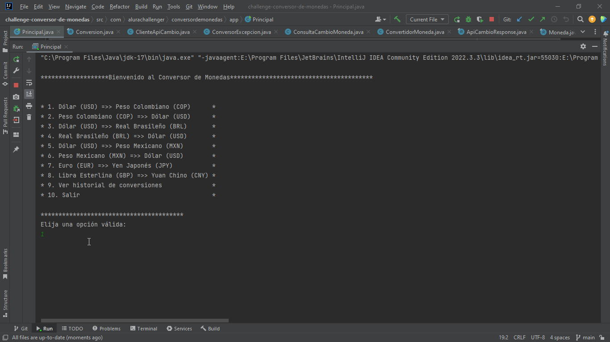

# 💱 Conversor de Monedas - Alura Challenge

  

  

¡Bienvenido al Conversor de Monedas! Este proyecto es una aplicación Java que permite convertir valores entre diferentes monedas utilizando tasas de cambio actualizadas desde una API externa. Es ideal para quienes necesitan realizar conversiones rápidas y precisas entre monedas internacionales.

## 🚀 Características
- Interfaz de consola interactiva: El usuario puede seleccionar entre varias opciones de conversión.
- Soporte para múltiples monedas:
  - Dólar estadounidense (USD)
  - Peso colombiano (COP)
  - Real brasileño (BRL)
  - Peso mexicano (MXN)
  - Euro (EUR)
  - Yen japonés (JPY)
  - Libra esterlina (GBP)
  - Yuan chino (CNY)
- Tasas de cambio actualizadas: Los datos se obtienen en tiempo real desde la API ExchangeRate-API.
- Gestión de errores: Manejo robusto de excepciones para entradas inválidas y errores en la API.
- 📜 Historial de conversiones:
   - Registro de todas las conversiones realizadas durante la ejecución.
   - Cada conversión incluye monedas, monto, resultado y fecha/hora.
   - Registros con marca de tiempo usando `java.time.LocalDateTime`.

## 🛠️ Tecnologías utilizadas
Lenguaje: Java 17
Librerías:
Gson: Para el manejo de JSON.
java.net.http: Para realizar solicitudes HTTP.
API: ExchangeRate-API

## 📋 Requisitos previos
Antes de ejecutar el proyecto, asegúrate de tener instalado lo siguiente:
Java 17 o superior.
Maven (opcional, si deseas gestionar dependencias).

## ⚙️ Instalación y ejecución
Clona este repositorio:
git clone https://github.com/tu-usuario/conversor-de-monedas.git
cd conversor-de-monedas

Compila el proyecto:
javac -d bin -sourcepath src src/com/alurachallenger/conversordemonedas/app/Principal.java

Ejecuta la aplicación:
java -cp bin com.alurachallenger.conversordemonedas.app.Principal

## 🖥️ Uso
1. Al ejecutar la aplicación, se mostrará un menú interactivo con las opciones de conversión disponibles:

  ****************Bienvenido al Conversor de Monedas***************************

   1. Dólar (USD) =>> Peso Colombiano (COP)      
   2. Peso Colombiano (COP) =>> Dólar (USD)      
   3. Dólar (USD) =>> Real Brasileño (BRL)       
   4. Real Brasileño (BRL) =>> Dólar (USD)       
   5. Dólar (USD) =>> Peso Mexicano (MXN)        
   6. Peso Mexicano (MXN) =>> Dólar (USD)        
   7. Euro (EUR) =>> Yen Japonés (JPY)           
   8. Libra Esterlina (GBP) =>> Yuan Chino (CNY) 
   9. Ver historial de conversiones
  10. Salir
                                     
****************************************
Elija una opción válida:

2. Selecciona una opción ingresando el número correspondiente.
3. Ingresa el monto que deseas convertir.
4. Obtendrás el resultado de la conversión en tiempo real.
5. Puedes consultar el historial de conversiones realizadas seleccionando la opción 9.

## 📂 Estructura del proyecto
El proyecto está organizado en los siguientes paquetes:
com.alurachallenger.conversordemonedas.app: Contiene la clase principal Principal que ejecuta la aplicación.
com.alurachallenger.conversordemonedas.consumoapi: Maneja la comunicación con la API externa.
com.alurachallenger.conversordemonedas.servicios: Contiene la lógica de negocio para la conversión de monedas.
com.alurachallenger.conversordemonedas.excepciones: Define excepciones personalizadas para el manejo de errores.
com.alurachallenger.conversordemonedas.modelo: Define modelos de datos como Moneda y ApiCambioResponse.

## 🛡️ Manejo de errores
El proyecto incluye un manejo robusto de errores para garantizar una experiencia de usuario fluida:
Errores de entrada: Si el usuario ingresa un valor no válido, se le pedirá que intente nuevamente.
Errores de API: Si la API no responde o devuelve un error, se mostrará un mensaje claro al usuario.
Validaciones: Se valida que los valores ingresados sean mayores a cero y que las monedas seleccionadas sean compatibles.

## 🤝 Contribuciones
¡Las contribuciones son bienvenidas! Si deseas mejorar este proyecto, sigue estos pasos:

1. Haz un fork del repositorio.
2. Crea una rama para tu nueva funcionalidad:
git checkout -b nueva-funcionalidad
3. Realiza tus cambios y haz un commit:
git commit -m "Agregada nueva funcionalidad"
4. Envía tus cambios:
git push origin nueva-funcionalidad
5. Abre un Pull Request en este repositorio

## 📜 Licencia
Este proyecto está bajo la licencia MIT. Consulta el archivo LICENSE para más detalles.

## 🌟 Agradecimientos
Este proyecto fue desarrollado como parte del Challenge de Alura Latam. ¡Gracias por la oportunidad de aprender y crecer como desarrollador!

## 👨‍💻 Autor

  

  <strong>Julio César Valencia</strong> 
  Desarrollador Java | Backend

  📧 <a href="mailto:sesarisuma@gmail.com">sesarisuma@gmail.com</a> 
  💼 <a href="https://www.linkedin.com/in/julio-cesar-valencia/">LinkedIn</a> 
  🐙 <a href="https://github.com/JulioCesarValencia">GitHub</a>

